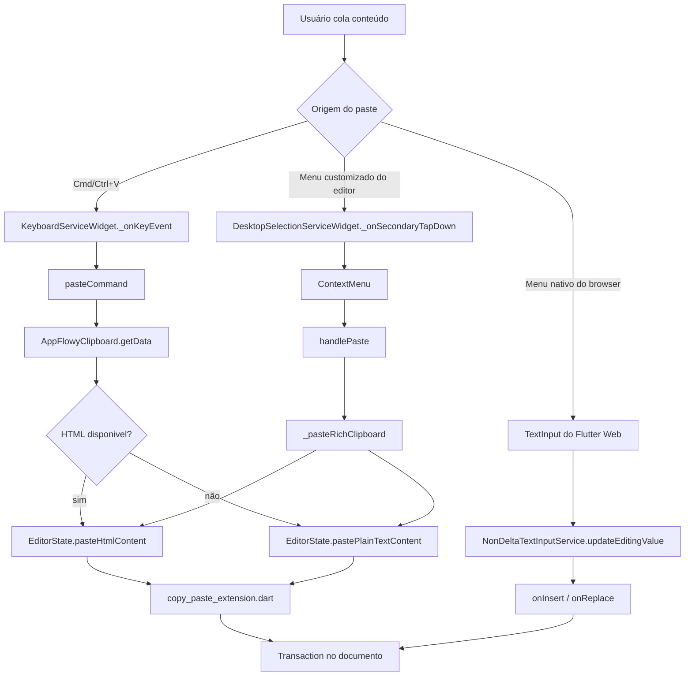
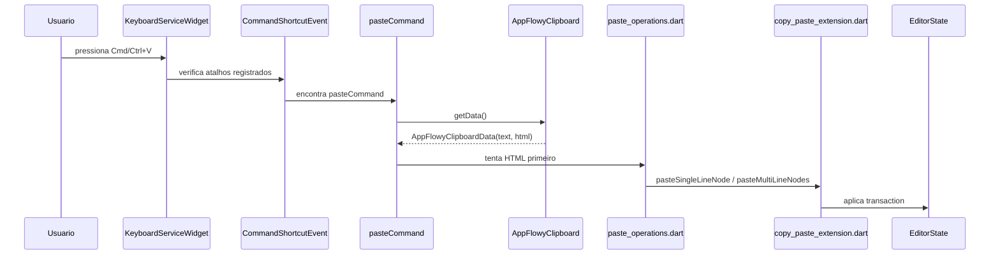
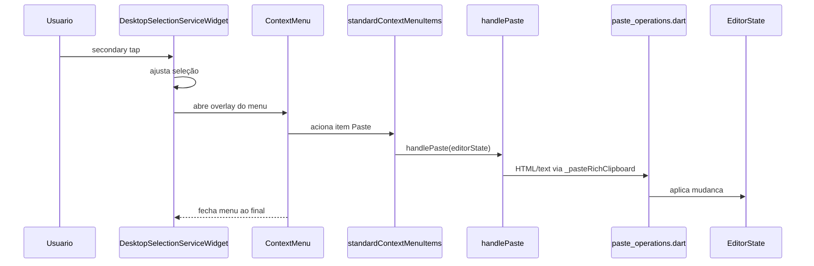
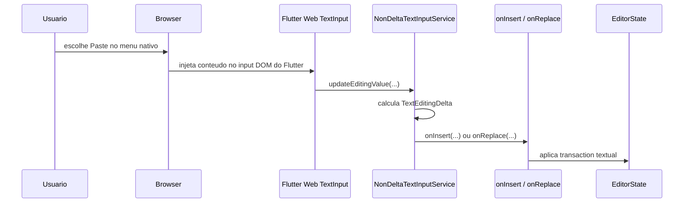

# Copy/Paste no AppFlowy Editor

## Objetivo

Este documento explica, parte por parte, como o sistema de copy/paste funciona no pacote `appflowy-editor`, com foco especial na plataforma WEB.

O objetivo principal é separar claramente três trilhas diferentes:

- colar via hotkey do editor (`cmd+v` no macOS Web, `ctrl+v` nas demais plataformas)
- colar via menu de contexto customizado implementado pelo pacote
- colar via menu nativo do browser

Essa separação é importante porque, na WEB deste projeto, esses caminhos não são equivalentes.

## Visão geral

## Arquivos centrais

Os arquivos abaixo formam o caminho principal de copy/paste na WEB:

- `lib/src/editor/editor_component/service/keyboard_service_widget.dart`
- `lib/src/editor/editor_component/service/shortcuts/command/paste_command.dart`
- `lib/src/editor/editor_component/service/paste_operations.dart`
- `lib/src/editor/editor_component/service/shortcuts/command/copy_paste_extension.dart`
- `lib/src/editor/editor_component/service/selection/desktop_selection_service.dart`
- `lib/src/service/context_menu/context_menu.dart`
- `lib/src/service/context_menu/built_in_context_menu_item.dart`
- `lib/src/service/internal_key_event_handlers/copy_paste_handler.dart`
- `lib/src/editor/editor_component/service/ime/non_delta_input_service.dart`
- `lib/src/editor/editor_component/service/ime/delta_input_on_insert_impl.dart`
- `lib/src/editor/editor_component/service/ime/delta_input_on_replace_impl.dart`
- `lib/src/infra/clipboard.dart`

## Peca zero: o modelo de clipboard do pacote

O tipo base do pacote e `AppFlowyClipboardData`, que possui dois campos:

- `text`
- `html`

Conceitualmente, isso indica que o editor foi desenhado para trabalhar com clipboard rico.

### O que o adaptador padrão realmente faz

O adaptador padrão em `lib/src/infra/clipboard.dart` é mais limitado:

- `AppFlowyClipboard.setData(...)` grava apenas `text` no clipboard do sistema
- `AppFlowyClipboard.getData()` lê apenas `Clipboard.kTextPlain`
- o campo `html` volta como `null` na implementação padrão real

Isso gera uma diferença importante entre arquitetura e integração real:

- o editor possui pipeline para colar HTML
- o adaptador padrão de clipboard, em execução real, entrega basicamente texto puro

### Por que existem testes de HTML paste

Os testes conseguem exercitar o fluxo de HTML porque usam `AppFlowyClipboard.mockSetData(...)`, que injeta manualmente `text` e `html`.

Ou seja:

- em teste, o pipeline de HTML pode ser validado
- na integracao padrão com o sistema, esse HTML não vem do `clipboard.dart`

## Antes do paste: como o copy prepara o sistema

Mesmo com o foco em paste, vale entender rapidamente o copy, porque ele mostra a intenção do design.

### `copyCommand`

O `copyCommand`:

1. lê a seleção atual
2. extrai o texto plano
3. serializa os nodes selecionados para HTML com `documentToHTML(...)`
4. chama `AppFlowyClipboard.setData(text: ..., html: ...)`

### `handleCopy`

O fluxo de menu de contexto usa `handleCopy(...)`, que tem a mesma ideia geral:

- monta `text`
- monta `html`
- envia ambos para o adaptador de clipboard

### Consequência

O editor trabalha internamente como se o clipboard suportasse `text + html`, mas a ponte padrão com o sistema persiste apenas `text`.

## Fluxo 1: colar via hotkey (`cmd+v` / `ctrl+v`)

Esse é o caminho principal e mais explícito do editor na WEB.

## Como o atalho chega ao editor

O `AppFlowyEditor` monta o `KeyboardServiceWidget` como parte da árvore de serviços.

Quando o usuário pressiona uma hotkey:

1. o `Focus` do `KeyboardServiceWidget` recebe o `KeyEvent`
2. `_onKeyEvent(...)` percorre os `CommandShortcutEvent`s registrados
3. `standardCommandShortcutEvents` inclui `copyCommand`, `pasteCommands` e `cutCommand`

Na WEB, o binding correto e escolhido por `CommandShortcutEvent.updateCommand(...)`, que considera:

- `PlatformExtension.isWebOnMacOS`
- `PlatformExtension.isWebOnWindows`
- `PlatformExtension.isWebOnLinux`

Por isso, em um browser rodando no macOS, o evento de paste efetivo passa a ser `cmd+v`.

### Diagrama do fluxo de hotkey

## O que `pasteCommand` faz

O handler `_pasteCommandHandler` segue esta ordem:

1. verifica se existe seleção
2. chama `AppFlowyClipboard.getData()`
3. tenta usar `html` primeiro
4. se o HTML não existir, ou se `pasteHtmlContent(...)` retornar `false`, faz fallback para `text`

Resumo da regra:

- HTML tem prioridade
- texto puro é fallback

## O que `pasteHtmlContent(...)` faz

O caminho de HTML fica em `paste_operations.dart`.

Ele executa estas etapas:

1. converte a string HTML para `Document` com `htmlToDocument(...)`
2. extrai `document.root.children`
3. remove nodes vazios no início e no fim
4. se não sobrar nada, retorna `false`
5. se houver um único node, usa `pasteSingleLineNode(...)`
6. se houver vários nodes, usa `pasteMultiLineNodes(...)`

### Responsabilidade dessa camada

`pasteHtmlContent(...)` não insere diretamente no documento final.

Ele é responsável por:

- transformar HTML em nodes do modelo interno
- decidir qual estrategia de inserção usar

## O que `pastePlainTextContent(...)` faz

Quando o payload e texto puro, `paste_operations.dart` executa uma trilha diferente.

### Etapas

1. normaliza finais de linha
   - `\r\n` vira `\n`
   - `\r` vira `\n`
2. captura os atributos do inicio da seleção com `getDeltaAttributesInSelectionStart()`
3. remove a seleção atual, se necessario, com `deleteSelectionIfNeeded()`
4. tenta um caso especial com `maybeConvertToUrlOrPhone(...)`
5. divide o texto em paragrafos por `\n`
6. cria `paragraphNode(...)` para cada linha
7. detecta URL/telefone para produzir `href` ou `tel:`
8. escolhe entre `pasteSingleLineNode(...)` e `pasteMultiLineNodes(...)`

### Caso especial: transformar seleção em link

Se existir uma seleção simples não colapsada e o texto colado for:

- uma URL
- ou um telefone

o editor não insere nodes novos. Em vez disso, ele formata o trecho selecionado com atributo `href`.

Esse é um comportamento importante porque foge do modelo "colar = inserir texto".

## O papel de `copy_paste_extension.dart`

Depois que o payload já foi transformado em nodes, a extensão `EditorCopyPaste` faz a inserção real.

### `pasteSingleLineNode(...)`

Responsabilidades:

- deletar a seleção atual, se necessario
- localizar o node atual
- substituir um paragrafo vazio pelo node colado, quando fizer sentido
- inserir apenas o `Delta` se o destino ja tiver conteudo
- mesclar filhos em casos de lista
- atualizar a seleção final

### `pasteMultiLineNodes(...)`

Responsabilidades:

- deletar a seleção atual, se necessario
- tratar o caso em que o primeiro node colado não possui `delta`
- fazer merge do conteudo anterior e posterior do node atual nos nodes colados
- preservar caracteristicas estruturais do destino em alguns casos
- inserir os nodes resultantes
- remover o node original quando necessario
- posicionar a seleção ao final do bloco inserido

### Consequência arquitetural

`paste_operations.dart` prepara o conteudo.

`copy_paste_extension.dart` decide como esse conteudo entra no documento atual.

## Fluxo 2: colar via menu customizado do editor

Esse caminho existe no pacote e funciona bem como fluxo de desktop.

Na WEB deste projeto, porem, ele não e o caminho efetivo de clique direito.

Ainda assim, ele precisa ser entendido, porque o codigo existe e modela a intencao do editor.

### Diagrama do menu customizado

## Como o clique direito chega ao menu customizado

Na WEB, `SelectionServiceWidget` encaminha para `DesktopSelectionServiceWidget`, porque a plataforma e tratada como `DesktopOrWeb`.

Quando ocorre `secondary tap`:

1. `_onSecondaryTapDown(...)` calcula a seleção correta para o ponto clicado
2. chama `_showContextMenu(details)`
3. `_showContextMenu(...)` cria overlays
4. registra um interceptor de teclado
5. desabilita atalhos e foco de teclado enquanto o menu estiver aberto

### O que `ContextMenu` faz

O widget `ContextMenu` e apenas a camada visual.

Mas ele tem uma responsabilidade importante:

- manter o menu aberto ate que a acao assincrona termine

Isso evita uma corrida entre:

- fechamento do overlay
- mutacao da seleção
- pipeline de clipboard

## O que `standardContextMenuItems` faz

`standardContextMenuItems` liga tres acoes visuais a handlers:

- `Cut`
- `Copy`
- `Paste`

No caso de `Paste`, ele chama:

- `await handlePaste(editorState)`

## O que `handlePaste(...)` faz

Esse fluxo é parecido com a hotkey, mas possui uma diferença importante.

### Etapas

1. lê o clipboard com `AppFlowyClipboard.getData()`
2. se a seleção estiver colapsada, chama `_pasteRichClipboard(...)`
3. se a seleção não estiver colapsada:
   - primeiro chama `deleteSelectedContent(...)`
   - espera a exclusao terminar
   - so depois chama `_pasteRichClipboard(...)`

### Por que isso existe

O proprio comentario no codigo explica a motivacao:

- evitar corrida entre o menu de contexto customizado e o estado interno de seleção do editor

Ou seja, o fluxo do menu customizado precisa ser mais cuidadoso com sincronizacao do que o fluxo da hotkey.

## Por que o menu customizado não funciona na WEB

Aqui esta o ponto mais importante do documento.

O pacote tem suporte ao menu customizado, mas na WEB deste projeto ele não se torna o menu efetivo do clique direito.

### Causa principal

O browser continua exibindo o menu nativo porque o projeto não desabilita o `BrowserContextMenu` do Flutter Web.

Na pratica:

- o editor tenta abrir seu `ContextMenu` customizado
- mas o browser ainda e dono do clique direito
- o menu nativo do browser permanece ativo

### Evidencia no codigo

- a WEB realmente usa `DesktopSelectionServiceWidget`
- o caminho de `_onSecondaryTapDown(...)` existe
- o `contextMenuBuilder` e fornecido pelo exemplo e pelos testes
- mas não existe nenhuma chamada a `BrowserContextMenu.disableContextMenu()` no repositório

### Consequência

O fluxo customizado esta implementado, mas não vira o fluxo efetivo na WEB.

### Por que os testes não pegam esse problema

Os testes de `secondary tap` sao widget tests sinteticos.

Eles validam:

- que o gesto dispara
- que o `ContextMenu` é construído
- que a seleção é sincronizada

Mas eles não reproduzem o comportamento real do menu nativo do browser. Por isso, os testes passam mesmo que, na execucao web real, o browser intercepte o clique direito.

## Fluxo 3: colar via menu nativo do browser

Esse é o caminho efetivo de clique direito na WEB deste projeto.

Ele não usa o pipeline explícito de paste do editor.

Em vez disso, ele tende a cair no pipeline de `TextInput` do Flutter Web.

### Diagrama do menu nativo do browser

## O papel de `NonDeltaTextInputService`

Esse service implementa `TextInputClient`.

Na pratica, ele:

1. recebe o novo `TextEditingValue`
2. compara o valor antigo e o novo
3. calcula `TextEditingDelta`s
4. encaminha para callbacks especializados

Os callbacks relevantes aqui sao:

- `onInsert(...)`
- `onReplace(...)`
- `onDelete(...)`
- `onNonTextUpdate(...)`

Para o caso de paste, os mais importantes sao `onInsert(...)` e `onReplace(...)`.

## O que `onInsert(...)` faz

`onInsert(...)` trata o conteudo como inserção textual.

Responsabilidades:

- tentar executar `CharacterShortcutEvent`s quando fizer sentido
- deletar a seleção atual se ela não estiver colapsada
- inserir o texto no node atual
- atualizar a seleção final

Esse caminho trabalha em nivel de texto, não em nivel de "conteudo colado rico".

## O que `onReplace(...)` faz

`onReplace(...)` trata substituicoes textuais.

Responsabilidades:

- tentar `CharacterShortcutEvent`s
- substituir um range de texto
- ou converter a substituicao em inserção, dependendo do caso
- atualizar a seleção

Novamente, a operacao e textual.

## Diferenca estrutural do menu nativo

Quando o paste entra pelo menu nativo do browser, ele tende a bypassar:

- `pasteCommand`
- `AppFlowyClipboard.getData()`
- `pasteHtmlContent(...)`
- `pastePlainTextContent(...)`
- `pasteSingleLineNode(...)`
- `pasteMultiLineNodes(...)`

Ou seja, o pacote deixa de tratar aquilo como "paste rico" e passa a tratar como mudanca de texto recebida do sistema de input.

## Consequências praticas na WEB

### Hotkey do editor

Quando o usuário usa `cmd+v`:

- o editor entra no seu pipeline explícito de paste
- tenta HTML primeiro
- depois faz fallback para texto
- divide linhas em nodes quando necessario

### Menu nativo do browser

Quando o usuário usa `Paste` no menu nativo:

- o editor tende a receber a mudanca pelo canal de `TextInput`
- a operacao passa a ser tratada como inserção/substituicao textual
- o pipeline rico de paste do editor pode não ser usado

### Bug conhecido no caminho nativo da WEB

Existe um bug documentado especificamente para o caminho de paste via menu nativo do browser:

- [web-native-paste-bug.md](./web-native-paste-bug.md)

Esse documento cobre:

- os sintomas observados
- a hipotese de causa raiz
- a proposta de correcao com code diffs
- os testes de regressao recomendados

Essa é a principal diferença de comportamento na WEB.

## Responsabilidade de cada componente

| Componente | Responsabilidade principal | Entra em qual fluxo |
| --- | --- | --- |
| `editor.dart` | monta a árvore de serviços do editor | todos |
| `SelectionServiceWidget` | escolhe o service de seleção por plataforma | menu customizado |
| `DesktopSelectionServiceWidget` | trata seleção, `secondary tap` e overlay do menu | menu customizado |
| `ContextMenu` | renderiza o menu e espera a acao assincrona terminar | menu customizado |
| `standardContextMenuItems` | mapeia Cut/Copy/Paste para handlers | menu customizado |
| `copy_paste_handler.dart` | concentra `handleCopy`, `handleCut` e `handlePaste` | menu customizado |
| `KeyboardServiceWidget` | captura hotkeys e integra foco com input | hotkey, base do input web |
| `CommandShortcutEvent` | resolve o atalho correto por plataforma | hotkey |
| `paste_command.dart` | define a entrada de `cmd+v` e `cmd+shift+v` | hotkey |
| `clipboard.dart` | faz a ponte com o clipboard do sistema | hotkey, menu customizado |
| `paste_operations.dart` | converte HTML/texto em nodes do editor | hotkey, menu customizado |
| `copy_paste_extension.dart` | insere os nodes no documento atual | hotkey, menu customizado |
| `non_delta_input_service.dart` | recebe mudancas do `TextInputClient` | menu nativo do browser |
| `delta_input_on_insert_impl.dart` | trata inserção textual | menu nativo do browser |
| `delta_input_on_replace_impl.dart` | trata substituicao textual | menu nativo do browser |

## Comparativo final

| Aspecto | Hotkey `cmd+v` / `ctrl+v` | Menu customizado do editor | Menu nativo do browser |
| --- | --- | --- | --- |
| Ponto de entrada | `KeyboardServiceWidget` | `DesktopSelectionServiceWidget` | `NonDeltaTextInputService` |
| Usa `AppFlowyClipboard.getData()` | sim | sim | não |
| Tenta usar HTML | sim | sim | não diretamente |
| Usa `paste_operations.dart` | sim | sim | não |
| Usa `copy_paste_extension.dart` | sim | sim | não |
| Ajusta overlay/contexto | não | sim | não |
| Evita corrida com menu de contexto | não é necessário | sim | não se aplica |
| Caminho efetivo de clique direito na WEB deste projeto | não se aplica | não | sim |

## Resumo final

Na WEB, o pacote possui dois modelos diferentes de paste:

- um pipeline explícito de paste, ativado principalmente pela hotkey do editor
- um pipeline de entrada textual do Flutter Web, ativado quando o browser injeta conteúdo pelo sistema de input

O menu customizado do editor existe e está implementado, mas não é o caminho efetivo de clique direito na WEB deste projeto porque o menu nativo do browser continua ativo.

Em uma frase:

> `cmd+v` passa pelo sistema de paste do editor; `Paste` no menu nativo do browser tende a passar pelo sistema de `TextInput` do Flutter Web.
