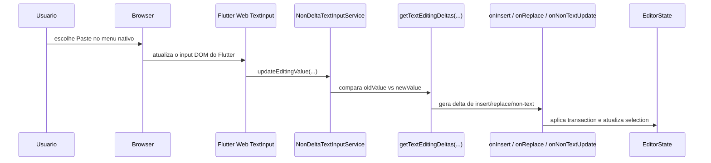

# Bug: paste via menu nativo do browser na WEB

## Resumo

Quando o usuario cola texto usando o menu nativo do browser na WEB, o editor pode entrar em um estado de selecao inconsistente.

### Sintomas observados

- apos colar `"batata"`, o cursor fica em `batat|a` em vez de `batata|`
- a selecao colapsada por clique do mouse deixa de acompanhar corretamente o ponto clicado
- ainda e possivel fazer selecao nao-colapsada por arraste
- ainda e possivel mover a selecao colapsada usando as setas do teclado

## Onde isso acontece no codigo

Esse bug nao passa pelo pipeline explicito de paste do editor, isto e:

- `pasteCommand`
- `paste_operations.dart`
- `copy_paste_extension.dart`

O caminho afetado e o do menu nativo do browser na WEB:



Arquivos principais envolvidos:

- `lib/src/editor/editor_component/service/ime/non_delta_input_service.dart`
- `lib/src/editor/editor_component/service/ime/text_diff.dart`
- `lib/src/editor/editor_component/service/ime/delta_input_on_insert_impl.dart`
- `lib/src/editor/editor_component/service/ime/delta_input_on_replace_impl.dart`
- `lib/src/editor/editor_component/service/ime/delta_input_on_non_text_update_impl.dart`

## Hipotese de causa raiz

O problema mais provavel e a combinacao de dois defeitos internos no caminho de `TextInput` da WEB.

> Observacao importante
>
> As causas abaixo sao uma hipotese tecnica forte baseada na leitura do codigo e nos sintomas observados.
> Este documento nao afirma que a causa ja foi definitivamente provada em execucao instrumentada.

### 1. Mistura entre valor formatado e valor bruto do browser

O `NonDeltaTextInputService` usa um espaco sentinela no inicio do texto para conseguir capturar corretamente certos eventos do IME e do backspace.

Internamente, ele trabalha com duas representacoes possiveis:

- valor formatado: com o espaco sentinela
- valor bruto: como o browser entrega

O problema e que `updateEditingValue(...)` assume que o valor recebido do browser esta na mesma representacao do `currentTextEditingValue`.

Quando isso nao acontece, o diff deixa de ser interpretado como insercao simples e pode virar um `TextEditingDeltaReplacement` artificial.

### 2. Normalizacao incompleta de offsets

Em `non_delta_input_service.dart`:

- `TextEditingDeltaInsertion.format()` ja trata condicionalmente o caso em que `oldText` comeca com espaco

Mas os outros tipos ainda deslocam offsets como se o sentinela sempre estivesse presente:

- `TextEditingDeltaDeletion.format()`
- `TextEditingDeltaReplacement.format()`
- `TextEditingDeltaNonTextUpdate.format()`

Isso e perigoso na WEB, porque o browser pode devolver um `TextEditingValue` sem esse sentinela.

Consequencia provavel:

- os offsets sao deslocados 1 posicao para a esquerda
- o cursor termina um caractere antes do final
- updates seguintes de selecao colapsada passam a operar sobre um estado parcialmente dessincronizado

### 3. `NonTextUpdate` ignora WEB

`delta_input_on_non_text_update_impl.dart` trata:

- Windows
- Linux
- macOS
- Android
- iOS

Mas nao trata explicitamente:

- `isWebOnWindows`
- `isWebOnLinux`
- `isWebOnMacOS`

Isso significa que updates de selecao/caret vindos do browser na WEB podem nao ser reaplicados ao `EditorState`.

Esse detalhe combina com o sintoma de "selecao colapsada por mouse fica travada", enquanto:

- a selecao nao-colapsada por arraste ainda funciona
- o movimento por teclado ainda funciona

## Por que os sintomas combinam com essa hipotese

### Cursor um caractere antes do final

Esse sintoma e compativel com um `selection.baseOffset` ou `selection.extentOffset` deslocado em `-1` durante a normalizacao do delta.

### Selecao colapsada por mouse "travada"

Depois do paste nativo, o browser continua emitindo mudancas de selecao pelo sistema de input.

Se o editor nao processa corretamente esses `NonTextUpdate`s na WEB, a selecao colapsada deixa de refletir o clique do mouse.

### Selecao por arraste ainda funciona

O arraste passa pelo `DesktopSelectionServiceWidget`, que calcula a selecao visual diretamente a partir do gesto, fora do pipeline quebrado de `TextInput`.

### Setas do teclado ainda funcionam

As setas usam os `CommandShortcutEvent`s do editor e chamam `moveCursorForward(...)` / `moveCursorBackward(...)`, entao conseguem continuar movendo a selecao independentemente do clique do mouse.

## Como resolver

A correcao recomendada e composta por duas partes.

### Parte 1: normalizar o `TextEditingValue` recebido do browser

Objetivo:

- garantir que `updateEditingValue(...)` compare old/new sempre na mesma representacao
- impedir que paste "raw" do browser seja interpretado como `replacement` artificial
- impedir deslocamentos de cursor por diferenca de representacao

Caminho:
`lib/src/editor/editor_component/service/ime/non_delta_input_service.dart`

```diff
--- a/lib/src/editor/editor_component/service/ime/non_delta_input_service.dart
+++ b/lib/src/editor/editor_component/service/ime/non_delta_input_service.dart
@@
   @override
   void updateEditingValue(TextEditingValue value) {
-    if (currentTextEditingValue == value) {
+    final normalizedValue = _normalizeIncomingValue(value);
+    if (currentTextEditingValue == normalizedValue) {
       return;
     }
@@
-    final deltas = getTextEditingDeltas(currentTextEditingValue, value);
+    final deltas = getTextEditingDeltas(
+      currentTextEditingValue,
+      normalizedValue,
+    );
@@
       () async {
         final oldValue = _currentTextEditingValue?.copyWith();
-        currentTextEditingValue = value;
+        currentTextEditingValue = normalizedValue;
         final willApply = await apply(deltas);
         if (!willApply) {
           currentTextEditingValue = oldValue;
           _textInputConnection?.setEditingState(oldValue!);
         }
       },
     );
   }
+
+  TextEditingValue _normalizeIncomingValue(TextEditingValue value) {
+    final current = _currentTextEditingValue;
+    if (current == null) {
+      return value;
+    }
+
+    final currentHasSentinel = current.text.startsWith(_whitespace);
+    final valueHasSentinel = value.text.startsWith(_whitespace);
+    if (currentHasSentinel == valueHasSentinel) {
+      return value;
+    }
+
+    return currentHasSentinel ? value.format() : value.unformat();
+  }
@@
 extension on TextEditingDeltaDeletion {
-  TextEditingDeltaDeletion format() => TextEditingDeltaDeletion(
-        oldText: oldText << _len,
-        deletedRange: deletedRange << _len,
-        selection: selection << _len,
-        composing: composing << _len,
-      );
+  TextEditingDeltaDeletion format() {
+    final startWithSpace = oldText.startsWith(_whitespace);
+    return TextEditingDeltaDeletion(
+      oldText: startWithSpace ? oldText << _len : oldText,
+      deletedRange: startWithSpace ? deletedRange << _len : deletedRange,
+      selection: startWithSpace ? selection << _len : selection,
+      composing: startWithSpace ? composing << _len : composing,
+    );
+  }
 }
 
 extension on TextEditingDeltaReplacement {
-  TextEditingDeltaReplacement format() => TextEditingDeltaReplacement(
-        oldText: oldText << _len,
-        replacementText: replacementText,
-        replacedRange: replacedRange << _len,
-        selection: selection << _len,
-        composing: composing << _len,
-      );
+  TextEditingDeltaReplacement format() {
+    final startWithSpace = oldText.startsWith(_whitespace);
+    return TextEditingDeltaReplacement(
+      oldText: startWithSpace ? oldText << _len : oldText,
+      replacementText: replacementText,
+      replacedRange: startWithSpace ? replacedRange << _len : replacedRange,
+      selection: startWithSpace ? selection << _len : selection,
+      composing: startWithSpace ? composing << _len : composing,
+    );
+  }
 }
 
 extension on TextEditingDeltaNonTextUpdate {
-  TextEditingDeltaNonTextUpdate format() => TextEditingDeltaNonTextUpdate(
-        oldText: oldText << _len,
-        selection: selection << _len,
-        composing: composing << _len,
-      );
+  TextEditingDeltaNonTextUpdate format() {
+    final startWithSpace = oldText.startsWith(_whitespace);
+    return TextEditingDeltaNonTextUpdate(
+      oldText: startWithSpace ? oldText << _len : oldText,
+      selection: startWithSpace ? selection << _len : selection,
+      composing: startWithSpace ? composing << _len : composing,
+    );
+  }
 }
```

### Parte 2: aplicar `NonTextUpdate` tambem na WEB

Objetivo:

- sincronizar selecao colapsada e caret quando o browser enviar updates de selecao
- impedir que clique simples apos o paste fique preso em estado antigo

Caminho:
`lib/src/editor/editor_component/service/ime/delta_input_on_non_text_update_impl.dart`

```diff
--- a/lib/src/editor/editor_component/service/ime/delta_input_on_non_text_update_impl.dart
+++ b/lib/src/editor/editor_component/service/ime/delta_input_on_non_text_update_impl.dart
@@
-  if (PlatformExtension.isWindows) {
+  if (PlatformExtension.isWindows || PlatformExtension.isWebOnWindows) {
     if (selection != null &&
         nonTextUpdate.composing == TextRange.empty &&
         nonTextUpdate.selection.isCollapsed) {
       editorState.selection = Selection.collapsed(
         Position(
           path: selection.start.path,
           offset: nonTextUpdate.selection.start,
         ),
       );
     }
-  } else if (PlatformExtension.isLinux) {
+  } else if (PlatformExtension.isLinux || PlatformExtension.isWebOnLinux) {
     if (selection != null) {
       editorState.updateSelectionWithReason(
         Selection.collapsed(
           Position(
             path: selection.start.path,
             offset: nonTextUpdate.selection.start,
           ),
         ),
       );
     }
-  } else if (PlatformExtension.isMacOS) {
+  } else if (PlatformExtension.isMacOS || PlatformExtension.isWebOnMacOS) {
     if (selection != null) {
       editorState.updateSelectionWithReason(
         Selection.collapsed(
           Position(
             path: selection.start.path,
             offset: nonTextUpdate.selection.start,
           ),
         ),
       );
     }
```

## Testes de regressao recomendados

Esses testes fecham exatamente o cenario web-like em que o browser entrega um valor bruto sem o sentinela interno.

Caminho:
`test/editor/editor_component/ime/non_delta_input_service_test.dart`

```diff
--- a/test/editor/editor_component/ime/non_delta_input_service_test.dart
+++ b/test/editor/editor_component/ime/non_delta_input_service_test.dart
@@
   group('NonDeltaTextInputService', () {
@@
     test('Delta insertion format', () {
@@
       assert(
         formatInsertion3.selection == const TextSelection.collapsed(offset: 2),
       );
     });
+
+    testWidgets(
+      'normalizes raw browser paste against formatted current value',
+      (tester) async {
+        TextEditingDeltaInsertion? capturedInsertion;
+        TextEditingDeltaReplacement? capturedReplacement;
+
+        final inputService = NonDeltaTextInputService(
+          onInsert: (value) async {
+            capturedInsertion = value;
+            return true;
+          },
+          onDelete: (_) async => true,
+          onReplace: (value) async {
+            capturedReplacement = value;
+            return true;
+          },
+          onNonTextUpdate: (_) async => true,
+          onPerformAction: (_) async {},
+        );
+
+        inputService.attach(
+          const TextEditingValue(
+            text: '',
+            selection: TextSelection.collapsed(offset: 0),
+          ),
+          const TextInputConfiguration(),
+        );
+
+        inputService.updateEditingValue(
+          const TextEditingValue(
+            text: 'batata',
+            selection: TextSelection.collapsed(offset: 6),
+            composing: TextRange.empty,
+          ),
+        );
+        await tester.pump();
+
+        expect(capturedReplacement, isNull);
+        expect(capturedInsertion, isNotNull);
+        expect(capturedInsertion!.textInserted, 'batata');
+        expect(capturedInsertion!.insertionOffset, 0);
+        expect(
+          capturedInsertion!.selection,
+          const TextSelection.collapsed(offset: 6),
+        );
+      },
+    );
+
+    testWidgets(
+      'normalizes raw selection-only updates after formatted attach',
+      (tester) async {
+        TextEditingDeltaNonTextUpdate? capturedNonTextUpdate;
+
+        final inputService = NonDeltaTextInputService(
+          onInsert: (_) async => true,
+          onDelete: (_) async => true,
+          onReplace: (_) async => true,
+          onNonTextUpdate: (value) async {
+            capturedNonTextUpdate = value;
+            return true;
+          },
+          onPerformAction: (_) async {},
+        );
+
+        inputService.attach(
+          const TextEditingValue(
+            text: 'batata',
+            selection: TextSelection.collapsed(offset: 6),
+          ),
+          const TextInputConfiguration(),
+        );
+
+        inputService.updateEditingValue(
+          const TextEditingValue(
+            text: 'batata',
+            selection: TextSelection.collapsed(offset: 3),
+            composing: TextRange.empty,
+          ),
+        );
+        await tester.pump();
+
+        expect(capturedNonTextUpdate, isNotNull);
+        expect(
+          capturedNonTextUpdate!.selection,
+          const TextSelection.collapsed(offset: 3),
+        );
+      },
+    );
   });
```

## Checklist de validacao manual

Depois da correcao:

1. colar `"batata"` via menu nativo do browser em um paragrafo vazio
2. confirmar que o cursor fica em `batata|`
3. clicar em varios pontos do texto e confirmar que a selecao colapsada acompanha o mouse
4. arrastar para criar selecao nao-colapsada e confirmar que continua funcionando
5. usar setas do teclado e confirmar que nao houve regressao
6. repetir o teste:
   - no fim da linha
   - no meio da linha
   - sobre selecao previa
   - em conteudo ja existente

## Observacao final

Este documento nao afirma que a correcao ja foi implementada.

Ele registra:

- o comportamento observado
- a hipotese tecnica mais forte para a causa
- a proposta concreta de correcao
- os testes necessarios para validar a mudanca
